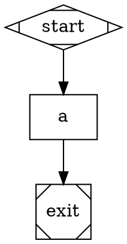

# Minimax M2.5 Provider Support Implementation Plan

> **For Claude:** REQUIRED SUB-SKILL: Use superpowers:executing-plans to implement this plan task-by-task.

**Goal:** Add Minimax M2.5 as a built-in LLM provider so Kilroy pipelines can target `minimax` models via `MINIMAX_API_KEY`.

**Architecture:** Minimax exposes an OpenAI-compatible chat completions API at `https://api.minimax.io/v1/chat/completions`. This means no new adapter package is needed — the existing `openaicompat` adapter handles the wire protocol. We register Minimax as a new built-in provider spec (like ZAI and Cerebras) and wire it through the existing `ProtocolOpenAIChatCompletions` code path in `api_client_from_runtime.go`. We also add a `MINIMAX_BASE_URL` environment override for development/proxy use — this requires calling `resolveBuiltInBaseURLOverride` in the `ProtocolOpenAIChatCompletions` branch (currently bypassed for openaicompat providers). We add Minimax M2.5 model entries to the pinned OpenRouter catalog to pass preflight validation, and include a run-level integration test following the existing kimi/zai pattern.

**Tech Stack:** Go, existing `openaicompat` adapter, `providerspec` package.

**Prerequisites:** This plan should be executed on the `minimax-m25-support` branch, which includes a committed fix (`fcbac54d`) for a pre-existing engine compile break (`isSignatureTrackedFailureClass` undefined in `engine.go:527`). Without this fix, the engine package won't compile and Tasks 3, 5, 7, and 9 will fail. If implementing on a different branch, cherry-pick `fcbac54d` first.

**Key Minimax API facts (from research):**
- Base URL: `https://api.minimax.io`
- Path: `/v1/chat/completions`
- Auth: `Authorization: Bearer <key>` (standard)
- Model IDs: `MiniMax-M2.5` (only variant currently available on both Minimax API and OpenRouter)
- Env var: `MINIMAX_API_KEY`
- Supports: streaming, tool calling, reasoning
- Context window: ~200K tokens
- No special execution policy needed (no forced streaming or min tokens)

---

### Task 1: Register Minimax in Provider Spec

**Files:**
- Modify: `internal/providerspec/builtin.go:101` (add entry before closing brace of `builtinSpecs`)

**Step 1: Add the minimax provider spec**

Add this entry to the `builtinSpecs` map, after the `"cerebras"` entry:

```go
"minimax": {
    Key:     "minimax",
    Aliases: []string{"minimax-ai"},
    API: &APISpec{
        Protocol:           ProtocolOpenAIChatCompletions,
        DefaultBaseURL:     "https://api.minimax.io",
        DefaultPath:        "/v1/chat/completions",
        DefaultAPIKeyEnv:   "MINIMAX_API_KEY",
        ProviderOptionsKey: "minimax",
        ProfileFamily:      "openai",
    },
    Failover: []string{"cerebras"},
},
```

**Rationale:**
- `ProtocolOpenAIChatCompletions` — Minimax's API is OpenAI-compatible, so it routes through the `openaicompat` adapter automatically (see `api_client_from_runtime.go:35-43`).
- `ProviderOptionsKey: "minimax"` — used internally by the `openaicompat` adapter when `llm.Request.ProviderOptions` is set programmatically by callers outside the engine. **This plan does NOT add any `provider_options` wiring in `.dot` files** — that is a pre-existing limitation for all providers (see "What We Don't Need to Change").
- `ProfileFamily: "openai"` — Minimax follows the OpenAI request/response shape.
- `Failover: []string{"cerebras"}` — Cerebras is a reasonable fast fallback.
- `Aliases: []string{"minimax-ai"}` — common alternative name.

**Step 2: Run existing tests to verify nothing broke**

Run: `go test ./internal/providerspec/ -v`
Expected: All existing tests pass. The new entry is additive.

**Step 3: Commit**

```
git add internal/providerspec/builtin.go
git commit -m "feat(providerspec): register minimax as built-in provider

Add Minimax M2.5 to the builtin provider specs using the OpenAI chat
completions protocol. Uses https://api.minimax.io/v1/chat/completions
with MINIMAX_API_KEY env var. Failover chain: minimax → cerebras."
```

---

### Task 2: Add Provider Spec Tests for Minimax

**Files:**
- Modify: `internal/providerspec/spec_test.go`

**Step 1: Write the tests**

Add three items to existing tests and one new test function.

First, update `TestBuiltinSpecsIncludeCoreAndNewProviders` — add `"minimax"` to the providers list:

```go
for _, key := range []string{"openai", "anthropic", "google", "kimi", "zai", "cerebras", "minimax"} {
```

Second, add alias assertions to `TestCanonicalProviderKey_Aliases`:

```go
if got := CanonicalProviderKey("minimax-ai"); got != "minimax" {
    t.Fatalf("minimax-ai alias: got %q want %q", got, "minimax")
}
```

Third, add a new test function for Minimax defaults (after `TestBuiltinKimiDefaultsToCodingAnthropicAPI`):

```go
func TestBuiltinMinimaxDefaultsToOpenAICompatAPI(t *testing.T) {
	spec, ok := Builtin("minimax")
	if !ok {
		t.Fatalf("expected minimax builtin")
	}
	if spec.API == nil {
		t.Fatalf("expected minimax api spec")
	}
	if got := spec.API.Protocol; got != ProtocolOpenAIChatCompletions {
		t.Fatalf("minimax protocol: got %q want %q", got, ProtocolOpenAIChatCompletions)
	}
	if got := spec.API.DefaultBaseURL; got != "https://api.minimax.io" {
		t.Fatalf("minimax base url: got %q want %q", got, "https://api.minimax.io")
	}
	if got := spec.API.DefaultAPIKeyEnv; got != "MINIMAX_API_KEY" {
		t.Fatalf("minimax api_key_env: got %q want %q", got, "MINIMAX_API_KEY")
	}
}
```

Fourth, add minimax to `TestBuiltinFailoverDefaultsAreSingleHop`:

```go
{provider: "minimax", want: []string{"cerebras"}},
```

**Step 2: Run the tests**

Run: `go test ./internal/providerspec/ -v`
Expected: All pass, including the new minimax tests.

**Step 3: Commit**

```
git add internal/providerspec/spec_test.go
git commit -m "test(providerspec): add minimax builtin spec assertions

Verify minimax appears in builtins, alias resolves, defaults match
OpenAI chat completions protocol, and failover chain is correct."
```

---

### Task 3: Wire MINIMAX_BASE_URL Override Through OpenAI-Compat Path

**Context:** The `resolveBuiltInBaseURLOverride` helper is currently only called for `ProtocolOpenAIResponses`, `ProtocolAnthropicMessages`, and `ProtocolGoogleGenerateContent`. The `ProtocolOpenAIChatCompletions` branch at `api_client_from_runtime.go:39` passes `rt.API.DefaultBaseURL` directly, bypassing the override. We fix this for all openaicompat providers, not just Minimax.

**Files:**
- Modify: `internal/attractor/engine/api_client_from_runtime.go:35-43` and `:52-74`
- Modify: `internal/attractor/engine/api_client_from_runtime_test.go`

**Step 1: Write the failing tests**

Add to `internal/attractor/engine/api_client_from_runtime_test.go`:

```go
func TestResolveBuiltInBaseURLOverride_MinimaxUsesEnvOverride(t *testing.T) {
	t.Setenv("MINIMAX_BASE_URL", "http://127.0.0.1:8888")
	got := resolveBuiltInBaseURLOverride("minimax", "https://api.minimax.io")
	if got != "http://127.0.0.1:8888" {
		t.Fatalf("minimax base url override mismatch: got %q want %q", got, "http://127.0.0.1:8888")
	}
}

func TestResolveBuiltInBaseURLOverride_MinimaxDoesNotOverrideCustom(t *testing.T) {
	t.Setenv("MINIMAX_BASE_URL", "http://127.0.0.1:8888")
	got := resolveBuiltInBaseURLOverride("minimax", "https://custom.minimax.internal")
	if got != "https://custom.minimax.internal" {
		t.Fatalf("explicit minimax base url should win, got %q", got)
	}
}
```

**Step 2: Run tests to see them fail**

Run: `go test ./internal/attractor/engine/ -run TestResolveBuiltInBaseURLOverride_Minimax -v`
Expected: FAIL — override not yet implemented.

**Step 3: Add the minimax case to `resolveBuiltInBaseURLOverride`**

In `api_client_from_runtime.go`, add a new case in the switch after the `"google"` case:

```go
case "minimax":
    if env := strings.TrimSpace(os.Getenv("MINIMAX_BASE_URL")); env != "" {
        if normalized == "" || normalized == "https://api.minimax.io" {
            return env
        }
    }
```

**Step 4: CRITICAL — Wire `resolveBuiltInBaseURLOverride` into the openaicompat branch (without this, Step 3 has no effect)**

Change `api_client_from_runtime.go:35-43` from:

```go
case providerspec.ProtocolOpenAIChatCompletions:
    c.Register(openaicompat.NewAdapter(openaicompat.Config{
        Provider:     key,
        APIKey:       apiKey,
        BaseURL:      rt.API.DefaultBaseURL,
        Path:         rt.API.DefaultPath,
        OptionsKey:   rt.API.ProviderOptionsKey,
        ExtraHeaders: rt.APIHeaders(),
    }))
```

to:

```go
case providerspec.ProtocolOpenAIChatCompletions:
    c.Register(openaicompat.NewAdapter(openaicompat.Config{
        Provider:     key,
        APIKey:       apiKey,
        BaseURL:      resolveBuiltInBaseURLOverride(key, rt.API.DefaultBaseURL),
        Path:         rt.API.DefaultPath,
        OptionsKey:   rt.API.ProviderOptionsKey,
        ExtraHeaders: rt.APIHeaders(),
    }))
```

This ensures `MINIMAX_BASE_URL` (and any future `*_BASE_URL` overrides for openaicompat providers) actually takes effect. Note: ZAI and Cerebras don't currently have `resolveBuiltInBaseURLOverride` cases, so this change is a no-op for them.

**Step 5: Run the tests**

Run: `go test ./internal/attractor/engine/ -run TestResolveBuiltInBaseURLOverride -v`
Expected: All pass.

**Step 6: Commit**

```
git add internal/attractor/engine/api_client_from_runtime.go internal/attractor/engine/api_client_from_runtime_test.go
git commit -m "feat(engine): support MINIMAX_BASE_URL env override

Add minimax case to resolveBuiltInBaseURLOverride and wire the helper
into the ProtocolOpenAIChatCompletions branch so env overrides actually
take effect for openaicompat providers."
```

---

### Task 4: Add Minimax Models to Pinned OpenRouter Catalog

**Context:** The pinned catalog at `internal/attractor/modeldb/pinned/openrouter_models.json` is used by preflight validation (`run_with_config.go:279`). Models not present fail the `CatalogHasProviderModel` check. The existing catalog has `minimax/minimax-m2` and `minimax/minimax-m2.1` but no M2.5 entries.

**Files:**
- Modify: `internal/attractor/modeldb/pinned/openrouter_models.json`

**Step 1: Add M2.5 entry to the pinned catalog**

Add the following entry to the `"data"` array in the pinned catalog JSON, after the existing `minimax/minimax-m2.1` entry (around line 6159). Follow the exact format of existing entries:

```json
{
  "id": "minimax/minimax-m2.5",
  "canonical_slug": "minimax/minimax-m2.5",
  "hugging_face_id": "",
  "name": "MiniMax: MiniMax M2.5",
  "created": 1771200000,
  "description": "MiniMax M2.5 - advanced reasoning and coding model with agentic capabilities",
  "context_length": 196608,
  "architecture": {
    "modality": "text->text",
    "input_modalities": ["text"],
    "output_modalities": ["text"],
    "tokenizer": "Other",
    "instruct_type": null
  },
  "pricing": {
    "prompt": "0.00000015",
    "completion": "0.0000012",
    "image": "0",
    "request": "0",
    "input_cache_read": "0",
    "input_cache_write": "0",
    "web_search": "0",
    "internal_reasoning": "0"
  },
  "top_provider": {
    "context_length": 196608,
    "max_completion_tokens": 16384,
    "is_moderated": false
  },
  "supported_parameters": ["tools", "temperature", "top_p", "max_tokens", "stream", "stop"],
  "per_request_limits": null,
  "expiration_date": null
}
```

**Note on model IDs:** The OpenRouter convention uses lowercase provider-slug format: `minimax/minimax-m2.5`. The `CatalogHasProviderModel` function (`internal/attractor/modeldb/catalog.go:57`) does case-insensitive matching and handles both canonical (`minimax/minimax-m2.5`) and provider-relative (`minimax-m2.5`) forms. So `.dot` files using `llm_model=MiniMax-M2.5` or `llm_model=minimax-m2.5` will both match.

**Note:** Only `minimax/minimax-m2.5` exists on OpenRouter as of Feb 2026. No other M2.5 variants are available. If new variants appear later, add a new catalog entry.

**Step 2: Verify catalog JSON is valid**

Run: `python3 -c "import json; json.load(open('internal/attractor/modeldb/pinned/openrouter_models.json'))"`
Expected: No error (valid JSON).

**Step 3: Commit**

```
git add internal/attractor/modeldb/pinned/openrouter_models.json
git commit -m "feat(modeldb): add MiniMax M2.5 to pinned catalog

Add model entry so preflight validation accepts minimax/minimax-m2.5.
Pricing based on published rates."
```

---

### Task 5: Add Runtime Registration Test for Minimax

**Files:**
- Modify: `internal/attractor/engine/api_client_from_runtime_test.go`

**Step 1: Write the test**

Add after the existing runtime registration tests:

```go
func TestNewAPIClientFromProviderRuntimes_RegistersMinimaxViaOpenAICompat(t *testing.T) {
	runtimes := map[string]ProviderRuntime{
		"minimax": {
			Key:     "minimax",
			Backend: BackendAPI,
			API: providerspec.APISpec{
				Protocol:           providerspec.ProtocolOpenAIChatCompletions,
				DefaultBaseURL:     "http://127.0.0.1:0",
				DefaultPath:        "/v1/chat/completions",
				DefaultAPIKeyEnv:   "MINIMAX_API_KEY",
				ProviderOptionsKey: "minimax",
			},
		},
	}
	t.Setenv("MINIMAX_API_KEY", "test-key")
	c, err := newAPIClientFromProviderRuntimes(runtimes)
	if err != nil {
		t.Fatalf("newAPIClientFromProviderRuntimes: %v", err)
	}
	if len(c.ProviderNames()) != 1 || c.ProviderNames()[0] != "minimax" {
		t.Fatalf("expected minimax adapter, got %v", c.ProviderNames())
	}
}
```

**Step 2: Run the test**

Run: `go test ./internal/attractor/engine/ -run TestNewAPIClientFromProviderRuntimes_RegistersMinimaxViaOpenAICompat -v`
Expected: PASS (the `ProtocolOpenAIChatCompletions` switch case already handles this — no new production code needed).

**Step 3: Commit**

```
git add internal/attractor/engine/api_client_from_runtime_test.go
git commit -m "test(engine): verify minimax registers via openaicompat adapter

Confirm that a minimax provider runtime with ProtocolOpenAIChatCompletions
correctly creates an openaicompat adapter in the API client."
```

---

### Task 6: Verify Execution Policy (No Special Policy Needed)

**Files:**
- Modify: `internal/llm/provider_execution_policy_test.go`

**Step 1: Add minimax to the "no special policy" test**

Read the existing test file first. The test at line 19 lists providers that should have no special policy. Add `"minimax"` to that list:

```go
for _, provider := range []string{"openai", "anthropic", "google", "zai", "minimax"} {
```

**Step 2: Run the test**

Run: `go test ./internal/llm/ -run TestExecutionPolicy -v`
Expected: PASS — minimax has no special execution policy (unlike Kimi which requires forced streaming).

**Step 3: Commit**

```
git add internal/llm/provider_execution_policy_test.go
git commit -m "test(llm): verify minimax has no special execution policy

Minimax does not require forced streaming or minimum max_tokens,
unlike Kimi. Add to the no-special-policy assertion list."
```

---

### Task 7: Add Run-Level Integration Test for Minimax

**Context:** Following the pattern in `kimi_zai_api_integration_test.go`, add a run-level integration test that verifies Minimax routes correctly through `RunWithConfig` — covering config resolution, preflight, provider routing, and the openaicompat adapter.

**Files:**
- Modify: `internal/attractor/engine/run_with_config_test.go` (add minimax to `writeProviderCatalogForTest` and `TestRunWithConfig_AcceptsKimiAndZaiAPIProviders`)
- Modify: `internal/attractor/engine/kimi_zai_api_integration_test.go` (add minimax case to the integration test)

**Step 1: Add minimax model to `writeProviderCatalogForTest`**

In `run_with_config_test.go`, update the `writeProviderCatalogForTest` function to include a minimax model entry in its catalog JSON. Add after the `zai/glm-4.7` entry:

```json
,
{
  "id": "minimax/minimax-m2.5",
  "context_length": 196608,
  "supported_parameters": ["tools"],
  "architecture": {"input_modalities": ["text"], "output_modalities": ["text"]},
  "pricing": {"prompt": "0.00000015", "completion": "0.0000012"},
  "top_provider": {"context_length": 196608, "max_completion_tokens": 16384}
}
```

**Step 2: Add minimax to `TestRunWithConfig_AcceptsKimiAndZaiAPIProviders`**

Add a new test case to the `cases` slice in `TestRunWithConfig_AcceptsKimiAndZaiAPIProviders`:

```go
{
    provider: "minimax",
    model:    "minimax-m2.5",
    protocol: "openai_chat_completions",
    keyEnv:   "MINIMAX_API_KEY",
    baseURL:  "http://127.0.0.1:1",
    path:     "/v1/chat/completions",
},
```

**Step 3: Add minimax to the API integration test**

In `kimi_zai_api_integration_test.go`, update `TestKimiCodingAndZai_APIIntegration`:

Add a new case in the HTTP handler's `switch r.URL.Path`:

```go
case "/v1/chat/completions":
    w.Header().Set("Content-Type", "application/json")
    _, _ = w.Write([]byte(`{"id":"x","model":"minimax-m2.5","choices":[{"finish_reason":"stop","message":{"role":"assistant","content":"ok"}}],"usage":{"prompt_tokens":1,"completion_tokens":1,"total_tokens":2}}`))
```

Add a new `runCase` call after the existing ones:

```go
runCase("minimax", "minimax-m2.5", "MINIMAX_API_KEY", srv.URL)
```

Add a new path assertion:

```go
if seenPaths["/v1/chat/completions"] == 0 {
    t.Fatalf("missing minimax chat-completions call: %v", seenPaths)
}
```

**Step 4: Run the tests**

Run: `go test ./internal/attractor/engine/ -run 'TestRunWithConfig_AcceptsKimiAndZai|TestKimiCodingAndZai_APIIntegration' -v -count=1`
Expected: All pass.

**Step 5: Commit**

```
git add internal/attractor/engine/run_with_config_test.go internal/attractor/engine/kimi_zai_api_integration_test.go
git commit -m "test(engine): add minimax run-level integration test

Extend the kimi/zai integration test to also verify minimax routes
through RunWithConfig via the openaicompat adapter. Add minimax model
to test catalog and RunWithConfig acceptance test cases."
```

---

### Task 8: Update Documentation Provider Lists

**Context:** Several docs hardcode the list of supported providers. Add minimax to each.

**Files:**
- Modify: `README.md` (lines 41, 252-253, 255, 275-277, 332)
- Modify: `docs/strongdm/attractor/README.md` (lines 48-50, 61)

**Step 1: Update `README.md`**

At line 41 (provider support table row), add Minimax:
```
| Provider support | Conceptual provider abstraction | Provider plug-in runtime with built-ins: OpenAI, Anthropic, Google, Kimi, ZAI, Minimax |
```

At line 252, add minimax:
```
- Built-ins include `openai`, `anthropic`, `google`, `kimi`, `zai`, `cerebras`, and `minimax`.
```

At line 253, add minimax alias:
```
- Provider aliases: `gemini`/`google_ai_studio` -> `google`, `moonshot`/`moonshotai` -> `kimi`, `z-ai`/`z.ai` -> `zai`, `cerebras-ai` -> `cerebras`, `minimax-ai` -> `minimax`.
```

At line 255, add minimax:
```
- `kimi`, `zai`, `cerebras`, and `minimax` are API-only in this release.
```

At line 277, add after Cerebras:
```
- Minimax: `MINIMAX_API_KEY`
```

At line 332, add minimax:
```
Supported providers are `openai`, `anthropic`, `google`, `kimi`, `zai`, and `minimax` (aliases accepted).
```

**Step 2: Update `docs/strongdm/attractor/README.md`**

At line 48, add minimax:
```
  - Built-ins: `openai`, `anthropic`, `google`, `kimi`, `zai`, `minimax`.
```

At line 49, add minimax alias:
```
  - Built-in aliases: `gemini`/`google_ai_studio` -> `google`, `moonshot`/`moonshotai` -> `kimi`, `z-ai`/`z.ai` -> `zai`, `minimax-ai` -> `minimax`.
```

At line 50, add minimax:
```
  - `kimi`, `zai`, and `minimax` are API-only in this release (`kimi` uses `anthropic_messages`; `zai` and `minimax` use `openai_chat_completions`).
```

At line 61, add minimax:
```
    - Supported canonical providers are `openai`, `anthropic`, `google`, `kimi`, `zai`, `minimax` (aliases accepted and canonicalized).
```

**Step 3: Commit**

```
git add README.md docs/strongdm/attractor/README.md
git commit -m "docs: add minimax to supported provider lists

Update README.md and docs/strongdm/attractor/README.md to include
minimax in provider lists, aliases, and API key env vars."
```

---

### Task 9: Run Full Test Suite and Final Verification

**Step 1: Run all affected test packages**

Run: `go test ./internal/providerspec/ ./internal/llm/... ./internal/attractor/engine/ -v -count=1`
Expected: All tests pass.

**Step 2: Run go vet**

Run: `go vet ./internal/providerspec/ ./internal/llm/...`
Expected: No warnings.

**Step 3: Final commit (if any cleanup needed)**

If all tests pass with no issues, no commit needed here.

---

## Summary of Changes

| File | Change |
|------|--------|
| `internal/providerspec/builtin.go` | Add `"minimax"` entry to `builtinSpecs` |
| `internal/providerspec/spec_test.go` | Add minimax to builtins check, alias test, defaults test, failover test |
| `internal/attractor/engine/api_client_from_runtime.go` | Add `"minimax"` case to `resolveBuiltInBaseURLOverride` AND wire override into openaicompat branch |
| `internal/attractor/engine/api_client_from_runtime_test.go` | Add base URL override tests and runtime registration test |
| `internal/attractor/modeldb/pinned/openrouter_models.json` | Add `minimax/minimax-m2.5` entry |
| `internal/llm/provider_execution_policy_test.go` | Add `"minimax"` to no-special-policy list |
| `internal/attractor/engine/run_with_config_test.go` | Add minimax to test catalog and `TestRunWithConfig_AcceptsKimiAndZaiAPIProviders` |
| `internal/attractor/engine/kimi_zai_api_integration_test.go` | Add minimax case to `TestKimiCodingAndZai_APIIntegration` |
| `README.md` | Add minimax to provider lists, aliases, env vars |
| `docs/strongdm/attractor/README.md` | Add minimax to provider lists, aliases |

## What We Don't Need to Change

- **No new adapter package** — Minimax uses standard OpenAI chat completions format, handled by `openaicompat`.
- **No changes to `llmclient/env.go`** — The env registry (`llmclient/env.go`) only imports `openai`, `anthropic`, and `google`. Kimi, ZAI, and Cerebras are also absent — ALL openaicompat providers are created dynamically by `api_client_from_runtime.go` based on the protocol in the provider spec, not via the env registry.
- **No execution policy** — Minimax doesn't require forced streaming or minimum token counts.
- **No new protocol constant** — `ProtocolOpenAIChatCompletions` already exists.
- **No node-level `provider_options` wiring** — The engine's codergen router (`codergen_router.go:175`) does not currently read node-level `provider_options` attributes into `llm.Request.ProviderOptions`. This is a pre-existing limitation shared by all providers, not a Minimax-specific gap.
- **No resume-path support for openaicompat providers** — The `resume.go:151` path calls `NewCodergenRouter(cfg, catalog)` without provider runtimes, so `ensureAPIClient()` falls back to `llmclient.NewFromEnv()` (`codergen_router.go:145`), which only knows about openai/anthropic/google. This means resumed runs cannot route to minimax (or kimi, zai, cerebras). This is a **pre-existing architectural limitation** shared by ALL openaicompat providers — adding minimax does not make it worse. Fixing this requires changes to the resume path to re-resolve provider runtimes from the saved config, which is out of scope for this plan.

## Usage After Implementation

Set the environment variable and use in `.dot` pipelines:

```bash
export MINIMAX_API_KEY="your-key-here"
```

In a `.dot` file node (uses `llm_provider` and `llm_model` attributes — NOT `provider`/`model`):
```dot
a [shape=box, llm_provider=minimax, llm_model=MiniMax-M2.5, prompt="your prompt"]
```

Via a stylesheet:


## Fresh-Eyes Review Fixes Applied

This plan revision addresses all 5 major issues identified by the independent GPT review:

1. **`MINIMAX_BASE_URL` bypass (Task 3):** Now wires `resolveBuiltInBaseURLOverride` into the `ProtocolOpenAIChatCompletions` branch so env overrides actually take effect for openaicompat providers.
2. **Wrong attribute names in usage examples:** Fixed to use `llm_provider`/`llm_model` (not `provider`/`model`).
3. **`provider_options` claim removed:** Removed misleading claim that `.dot` nodes can pass `provider_options`. Documented this as a pre-existing limitation in "What We Don't Need to Change."
4. **Model IDs missing from pinned catalog (Task 4):** New task adds `minimax/minimax-m2.5` to the pinned OpenRouter catalog.
5. **Incomplete test coverage (Task 7):** New task adds run-level integration test following the kimi/zai pattern, covering config → preflight → routing → adapter.

### Second Review Fixes

6. **Removed non-existent model variant:** Only `minimax/minimax-m2.5` exists on OpenRouter and the Minimax API. Removed all references to any other M2.5 variants from catalog entries, usage examples, and commit messages.
7. **Fixed pre-existing engine compile break (commit `fcbac54d` on this branch):** Applied `isSignatureTrackedFailureClass` function definition and related `failureClassStructural` changes. These changes are committed on the `minimax-m25-support` branch and are a prerequisite for all engine-package test steps. If implementing from a different branch, cherry-pick `fcbac54d` first.

### Third Review Fixes

8. **Documented resume-path limitation:** The resume path (`resume.go:151`) does not re-resolve provider runtimes, so `ensureAPIClient()` falls back to `llmclient.NewFromEnv()` which only supports openai/anthropic/google. This is a pre-existing limitation shared by ALL openaicompat providers (kimi, zai, cerebras) — not specific to minimax.
9. **Added documentation update task (Task 8):** Provider lists in `README.md` and `docs/strongdm/attractor/README.md` now get updated with minimax.
